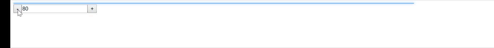
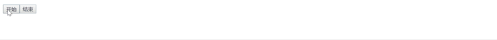

# react-progress-bar
Simple github style progress bar for React.  
  
  
  
## 1. Installation
> npm install --save react-prog-bar

## 2. Demo & Examples
To build the examples locally, run:
> npm install  
npm start

## 3. Usage
`react-progress-bar` can be used for `ajax` or `fetch`. Pseudo code below: 
```js
let isFetching = false;
const loadData = () => {
  isFetching = true;
  fetch(url).then(response => {
      isFetching = false;
  });
}

import ReactProgress from 'react-prog-bar';
<ReactCodeMirror trigger={isFetching}/>,
```

## 4. Properties

prop | type | default | notes  
------- | ------- | ------- | -------
**trigger** | bool or number | false | Show the bar or set percent of the width, when trigger is number, its value should be `0-100`
**height** | string | 2px | Height of bar
**top** | bool | false | Set the bar attach to top or not
**color** | string | #77b6ff | Color of bar
**starColor** | string | white | The point at beginning of bar.
**waitTime** | number | 10 | When `trigger` is true, the bar will take this time to 80% width and wait until `trigger` switch to false
**finishTime** | number | 1 | When `trigger` switch from true to false, the bar will take this time to 100% width
**stepTime** | number | 0.4 | When `trigger` is number and the value is changed, the bar's width change from value1(%) to value2(%) during `stepTime`
**disappearTime** | number | 0.4 | When the bar's width is 100%, it will be invisible in `disappearTime`

## License
Copyright (c) 2017 ZiQiangWang [MIT](https://github.com/ZiQiangWang/react-progress-bar/blob/master/LICENSE) Licensed.
